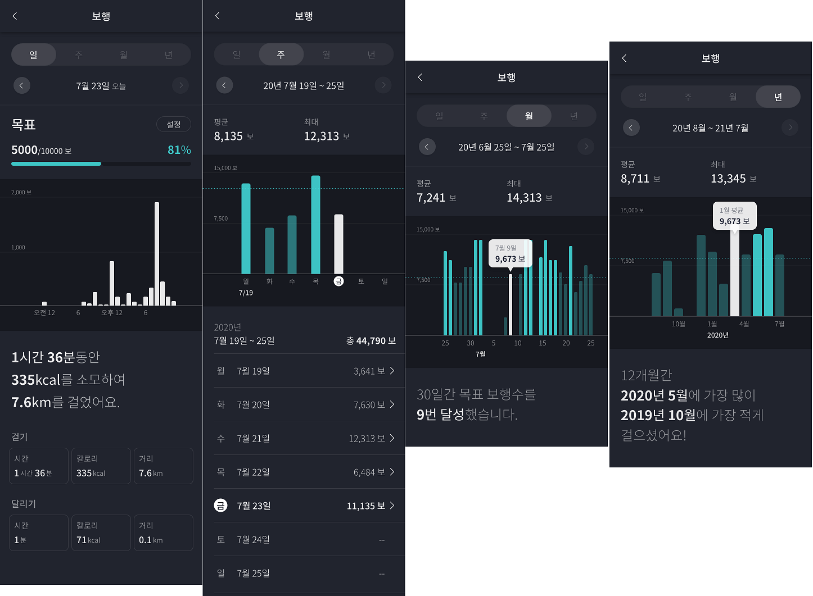
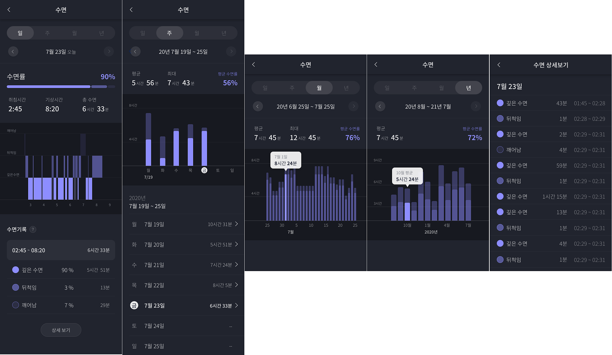
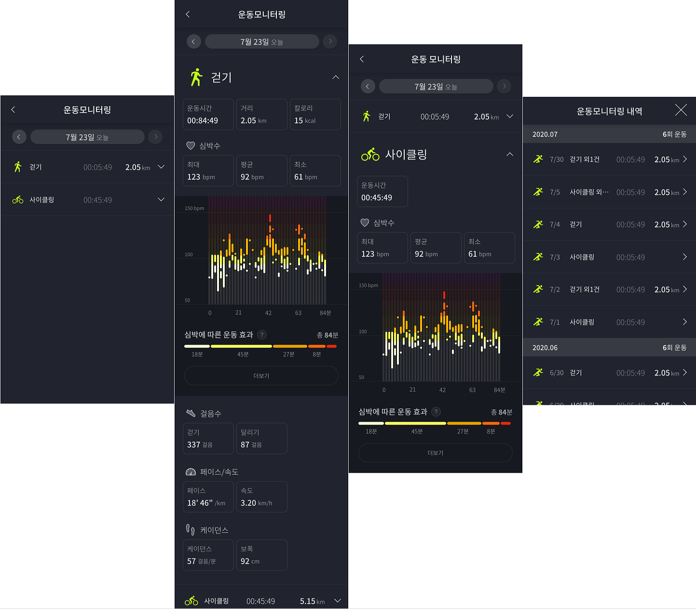
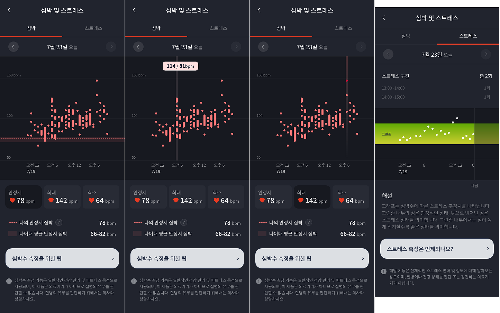
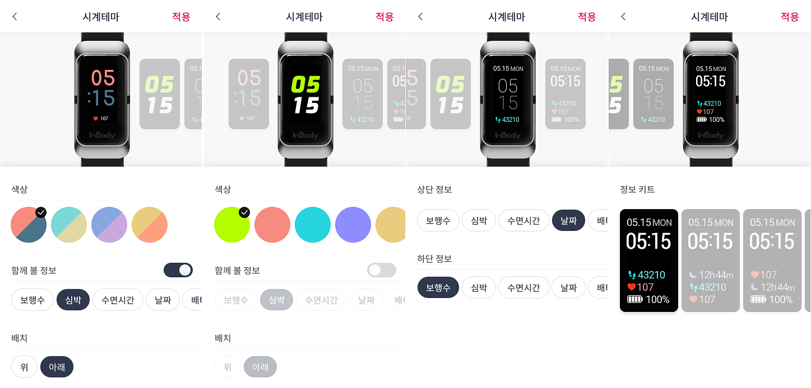

# 인바디앱 밴드3
> 보안상 코드는 업로드가 불가하여, 앱 이미지로 대체.
> 실제 운영 중인 앱이며 다운로드 후 사용이 가능함. ( *단 인바디 밴드3를 소지하고 있어야 함. )
---

- ### 목차

**[1. 프로젝트 정보](#1-프로젝트-정보)**

**[2. 주요기능 및 스크린샷](#2-주요기능-및-스크린샷)**

---

## 1. 프로젝트 정보

**프로젝트기간** **:**
- 2021.04 ~ 2021.09 

**팀 구성원** **:**
- 총 6명
  - Front-end : 1명 ( 인앱웹뷰 개발 )
  - Back-end : 4명 ( AOS개발자 2명, IOS개발자 2명)
  - Server : 1명

**사용 언어 및 툴** **:** 
- HTML
- CSS
- Vanilla JS
- vsCode
- 앱 브릿지 연동으로 데이터 통신

**목적** **:** 
- 24시간 활동량 측정을 통해 일상 생활에서 소모하는 칼로리 기록 및 관리
- 언제 어디서나 간편하게 체성분 검사가 가능

**기능** **:**
- **보행** : 일상생활에서 소모하는 칼로리를 기록하고 관리
- **수면** : 근육 회복에 도움이 되는 질 높은 수면과 적절한 수면을 위한 수면습관 체크 및 개선
- **운동 모니터링** : 운동 시간, 거리, 심박수, 보행수, 열량데이터를 측정하고 기록
- **심박 및 스트레스** : 실시간 심박 측정, 심장박동 변화 분석을 통한 스트레스 측정
- **워치페이스** : 밴드3 인터페이스 커스터마이징이 가능

## 2. 주요기능 및 스크린샷
## 보행

---
## 수면

---
## 운동 모니터링

---
## 심박 및 스트레스

---
## 워치페이스

---

